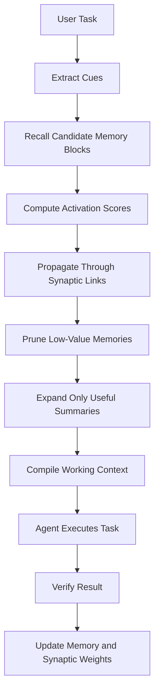

# Progressive Synaptic Memory

> A token-efficient long-term memory mechanism for LLM Agents.  
> 面向 LLM Agent 的低 Token 长期记忆机制。

Progressive Synaptic Memory is a concept paper and technical whitepaper about a memory architecture for LLM agents. The core idea is simple:

> Memory should not be retrieved all at once. It should be progressively activated, reconstructed, and compressed into the working context needed by the current task.

中文核心观点：

> 记忆不应该被一次性检索出来，而应该被逐步唤醒、重构和压缩成当前任务真正需要的工作上下文。

## Read The Paper

- [中文版本](./paper.zh-CN.md)
- [English Version](./paper.en.md)

## Core Idea

Most current LLM agent memory systems use a store-then-retrieve pattern: retrieve several memory chunks from history, inject them into the prompt, and let the model reason over them. This works for small memory, but it becomes expensive and noisy as the memory grows.

Progressive Synaptic Memory proposes a different direction:

```txt
Raw memory is stored outside the context.
Memory is compressed into meaningful memory blocks.
Memory blocks are connected through weighted synaptic links.
Inactive memory becomes dormant instead of being deleted.
Current tasks activate a small set of cues.
Activation propagates through the memory graph in limited hops.
Only the most useful summaries, SOPs, Skills, and warnings enter the context.
```

## Why It Matters

This mechanism aims to solve several practical problems in agent systems:

- Long-term memory causes high token cost.
- Retrieved chunks are often similar but not truly useful.
- Agents fail to reuse successful work procedures.
- User preferences and project experience are hard to preserve.
- Multi-agent memory sharing easily becomes noisy.
- Successful experiences are rarely converted into reusable SOPs.

## Keywords

LLM Agent, Agent Memory, Long-Term Memory, Synaptic Memory, Graph Memory, Progressive Retrieval, Memory Compression, SOP, Skills, Token Efficiency, Agent Runtime, AI Employees, Multi-Agent Systems.

## Proposed Architecture



## Related Research

This paper is related to, and inspired by, several research directions:

- [MemGPT: Towards LLMs as Operating Systems](https://arxiv.org/abs/2310.08560)
- [Mem0: Building Production-Ready AI Agents with Scalable Long-Term Memory](https://arxiv.org/abs/2504.19413)
- [A-MEM: Agentic Memory for LLM Agents](https://arxiv.org/abs/2502.12110)
- [Memory is Reconstructed, Not Retrieved: Graph Memory for LLM Agents](https://arxiv.org/abs/2606.06036)
- [MemP: Exploring Agent Procedural Memory](https://arxiv.org/abs/2508.06433)

## License

MIT License.
