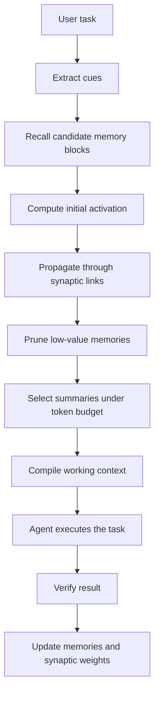

# Progressive Synaptic Memory: A Token-Efficient Long-Term Memory Mechanism for LLM Agents

Author: Jiusi  
Status: Concept paper / technical whitepaper draft  
Version: 0.1

## Abstract

Most long-term memory systems for LLM agents still follow a store-then-retrieve pattern: when a user asks a question, the system retrieves several memory snippets from chat history, documents, or vector databases, then injects those snippets into the model context. This approach is useful, but it does not scale well as memory grows. It increases token cost, introduces irrelevant context, and prevents agents from behaving more like humans, who often recall a rough scene first and then gradually recover details.

This paper proposes **Progressive Synaptic Memory**, a memory mechanism that treats agent memory as a dormant, compressed, connected, and gradually activated network of memory blocks. At runtime, the system activates a small set of cues from the current task, propagates activation through synaptic links between memory blocks, prunes low-value branches using relevance, importance, confidence, dormancy, and token budget, and finally passes only the most useful summaries, SOPs, or experience conclusions into the agent context.

The goal is not to make agents remember more text. The goal is to help agents remember the right things at the right moment. This mechanism is suitable for personal assistants, enterprise agent employees, multi-agent orchestration systems, SOP learning systems, customer preference memory, and long-running project collaboration.

## Keywords

LLM Agent, Long-Term Memory, Synaptic Memory, Graph Memory, Progressive Retrieval, Memory Compression, SOP, Skills, Token Efficiency, Agent Runtime

## 1. Background

LLM agents need memory to serve users over long periods of time. Without memory, an agent behaves like a one-shot chatbot. With memory, an agent can understand user preferences, project history, past failures, tool usage patterns, and reusable procedures.

However, common memory approaches have a core tension:

```txt
More memory gives the agent more experience.
More memory also makes the context larger, more expensive, and noisier.
```

Putting full history into the context is not scalable. Vector retrieval helps, but it often reduces the problem from "inject everything" to "inject similar text." This still creates three issues:

1. Similar text is not always useful for the current task.
2. Multi-hop memory relationships are difficult to capture in one retrieval step.
3. Retrieved chunks are still text and still consume tokens.

Human memory does not appear to work this way. People usually do not replay all prior experiences when thinking about a problem. They first recall a vague scene, then follow associations to related fragments, and finally construct a useful judgment for the current situation.

This paper abstracts that "gradual remembering" process into an agent memory mechanism.

## 2. Core Idea

The central claim is:

> Agent memory should not be a static database. It should be a synaptic network that can sleep, activate, propagate, prune, and strengthen.

More specifically:

```txt
Memory is not permanently deleted; it is downgraded into dormancy.
Recall is not one-shot retrieval; it is progressive activation.
Context is not a history warehouse; it is current working memory.
An SOP is not ordinary text; it is validated procedural memory.
A Skill is a capability; an SOP is a stable path for invoking that capability.
Synaptic links decide which memory should be recalled under which scene.
```

The design principle is:

> The database can be heavy, but the model context must stay thin.

## 3. Layered Memory Model

Progressive Synaptic Memory divides agent memory into four layers.

### 3.1 Raw Memory Layer

The raw memory layer stores complete information, such as:

- Original conversations
- Tool call logs
- Browser screenshots
- File modification records
- Terminal output
- Agent execution traces
- User feedback
- Verification results

This layer is the most complete and the most expensive. It should not enter the model context by default.

### 3.2 Memory Block Layer

The system compresses raw memory into Memory Blocks. A Memory Block is not an arbitrary text chunk. It is a meaningful unit of experience, such as:

- A user preference
- A failure lesson
- A successful pattern
- A project state
- A software usage method
- A reusable work scene

Example:

```txt
Memory Block: Chinese desktop UI simplification scene
Triggers: user complains about complexity, too much English, navigation has no visible response
Conclusion: left side should be navigation only; right side should show the full operation page; advanced settings should be folded by default; core actions should be visible
Related SOP: cn_desktop_ui_simplification_v2
```

### 3.3 Synaptic Link Layer

Memory Blocks can be connected. A connection is not a plain hyperlink. It is a weighted, directional synaptic edge with a relation type and feedback history.

Examples:

```txt
Chinese user preference -> Chinese UI simplification SOP
UI complexity complaint -> low cognitive load design principle
Model connection failure -> model configuration test SOP
Customer project A -> long-term preferences of customer A
```

These links allow controlled propagation when the system needs to recall related scenes.

### 3.4 Working Memory Layer

The working memory layer is the small amount of information that finally enters the model context. It usually contains:

- The current task goal
- A summary of the current best scene
- 3 to 5 relevant memory summaries
- 1 to 2 failure warnings
- Recommended SOPs, Skills, and tools

This layer must be constrained by a token budget.

## 4. Dormant Forgetting

In this paper, "forgetting" does not mean deletion. It means downgrading.

Memory can have four states:

```txt
Active: currently useful and may enter context
Warm: recently useful and easy to activate
Dormant: sleeping; only tags and summaries are kept hot
Archived: cold storage; accessed only during deep retrieval
```

Low-frequency, low-value, or low-confidence memories gradually become dormant. Dormant memories do not consume context, but they still keep trigger tags and references to the raw record.

This avoids two extremes:

```txt
Never forgetting: token explosion
Hard deletion: experience loss
```

A better approach is:

```txt
Low-value memory sleeps.
Important cues wake it up.
The summary wakes first.
Details wake only when needed.
```

## 5. Progressive Synaptic Activation Algorithm

### 5.1 High-Level Flow



### 5.2 Data Structures

```ts
type MemoryBlock = {
  id: string
  title: string

  cues: string[]
  tags: string[]
  summary: string
  detailRef: string
  rawRef: string

  embedding: number[]

  importance: number
  confidence: number
  usageCount: number
  lastUsedAt: Date

  dormantLevel: number
}
```

```ts
type SynapseLink = {
  fromMemoryId: string
  toMemoryId: string

  relation:
    | 'same_scene'
    | 'same_user'
    | 'same_problem'
    | 'same_solution'
    | 'caused_by'
    | 'fixed_by'
    | 'uses_same_skill'
    | 'calls_same_sop'

  weight: number
  confidence: number
  successCount: number
  failureCount: number
  lastActivatedAt: Date
}
```

### 5.3 Initial Recall

The system first extracts cues from the current task:

```ts
type QueryCue = {
  intent: string
  entities: string[]
  sceneTags: string[]
  problemTags: string[]
  userPreferenceTags: string[]
  artifactType?: string
}
```

A candidate memory score can be calculated as:

```txt
candidateScore =
  semanticSimilarity * 0.35
+ tagMatch           * 0.25
+ importance         * 0.15
+ recency            * 0.10
+ confidence         * 0.10
- dormantPenalty     * 0.15
```

This step only selects candidates. It does not inject them into the prompt.

### 5.4 Synaptic Propagation

Activated memory blocks pass part of their activation to neighboring blocks:

```txt
activation[next] += activation[current]
                  * synapseWeight
                  * relationBoost
                  * contextFit
                  - dormantPenalty
```

To prevent uncontrolled expansion, propagation must be limited:

```txt
Maximum depth: 1 to 2 hops
Maximum fan-out per layer: 5 to 8 nodes
Minimum activation threshold: 0.45
Final context memories: 3 to 5 summaries
```

### 5.5 Progressive Expansion

Memory expansion should be staged:

```txt
Stage 1: use tags only
Stage 2: expand summary
Stage 3: read detail when necessary
Stage 4: read raw memory only in rare cases
```

This is the system equivalent of "remembering the rough idea first, then details."

### 5.6 Context Compilation

The Context Compiler produces the final context under a token budget.

Example budget:

```txt
Total memory budget: 1000 tokens

Current best scene: 200 tokens
Relevant memory summaries: 400 tokens
Failure warnings: 150 tokens
Recommended SOPs / Skills: 250 tokens
```

If the budget is exceeded, the system should prioritize:

1. Memories directly related to the current goal
2. High-confidence success patterns
3. High-risk failure warnings
4. Long-term user preferences
5. Current project state

## 6. Relationship Between SOPs and Skills

This paper separates Skills from SOPs.

```txt
Skill = capability package
SOP = validated procedure
Synapse = learned connection that decides when to call which SOP or Skill
```

Example:

```txt
Skill: frontend implementation capability
SOP: Chinese desktop UI simplification workflow
Synapse: when the user says "complex", "hard to understand", or "too much English", activate this SOP
```

When an agent repeatedly completes similar tasks through a Skill, the system can compress the successful trajectory into an SOP. Next time a similar scene appears, the system does not need to load the full history. It can load the SOP ID, a short summary, and several critical rules.

This can significantly reduce token usage.

## 7. Relationship to Existing Research

This proposal does not claim that every component is invented from scratch. Instead, it combines several research directions into a product-oriented memory architecture for agents.

### 7.1 MemGPT

[MemGPT](https://arxiv.org/abs/2310.08560) compares LLM memory management to hierarchical memory in operating systems and uses virtual context management to work around limited context windows. Progressive Synaptic Memory follows the same intuition that context is working memory, not the entire memory store.

### 7.2 Mem0

[Mem0](https://arxiv.org/abs/2504.19413) proposes a production-oriented long-term memory architecture that extracts, consolidates, and retrieves salient information while reducing token cost. Progressive Synaptic Memory extends this direction by emphasizing dormancy, synaptic links, and staged expansion.

### 7.3 A-MEM

[A-MEM](https://arxiv.org/abs/2502.12110) organizes memories into a dynamically linked knowledge network inspired by the Zettelkasten method. Progressive Synaptic Memory shares the dynamic-linking idea, but focuses more on how links activate, prune, and compile into a token-limited runtime context.

### 7.4 MRAgent

[Memory is Reconstructed, Not Retrieved](https://arxiv.org/abs/2606.06036) proposes a Cue-Tag-Content graph and active memory reconstruction. It argues that memory should be reconstructed during reasoning rather than retrieved once before reasoning. Progressive Synaptic Memory is close to this direction and extends it toward SOPs, Skills, tool calls, and multi-agent orchestration.

### 7.5 Procedural Memory and SOPs

[MemP: Exploring Agent Procedural Memory](https://arxiv.org/abs/2508.06433) studies how to distill past agent trajectories into procedural memory. In this paper, SOPs are the product engineering form of procedural memory.

## 8. Why This Matters

The value of this mechanism is not a single isolated technique. The value is the system combination:

```txt
layered memory
+ dormant forgetting
+ synaptic memory graph
+ progressive activation
+ SOP procedural memory
+ token-budget context compilation
+ feedback-based learning
```

If implemented well, it can address several major pain points in agent products:

1. Long-term memory becomes too expensive in tokens.
2. Retrieved memories are similar but not truly useful.
3. Agents fail to accumulate stable working procedures.
4. User preferences and project experience are hard to reuse.
5. Multi-agent memory sharing becomes noisy and confusing.
6. Successful experiences are not converted into reusable SOPs.

This makes the mechanism suitable as the memory core of an agent operating system or an agent employee factory.

## 9. Evaluation Plan

The mechanism can be evaluated through the following experiments.

### 9.1 Token Cost

Compare three approaches:

```txt
Full Context: inject full history
Vector RAG: retrieve Top-K text chunks
Progressive Synaptic Memory: progressive synaptic recall
```

Metrics:

- Average input tokens
- Average output tokens
- Total cost per task
- Latency

### 9.2 Task Quality

Metrics:

- User preference hit rate
- Project state consistency
- Multi-step task success rate
- Repeated error rate
- SOP invocation accuracy

### 9.3 Recall Quality

Metrics:

- Relevant memory recall rate
- Irrelevant memory injection rate
- Multi-hop memory hit rate
- Summary sufficiency rate
- Percentage of cases requiring raw memory expansion

### 9.4 Learning Quality

Metrics:

- Successful SOP reuse rate
- Failure lesson reuse rate
- Synaptic weight stability
- Long-term user preference retention

## 10. Limitations

The mechanism still has open problems:

1. Automatic memory block segmentation requires experimentation.
2. Incorrect synaptic reinforcement may repeatedly activate bad experience.
3. Excessive compression may lose critical details.
4. Graph propagation must be controlled to avoid runaway expansion.
5. The system needs an explainable UI so users can understand why the agent recalled a memory.

Production systems should include:

- Human review for important SOPs
- Memory confidence scores
- Failure feedback
- Synaptic weight decay
- Traceability to raw memory
- Explainable memory invocation logs

## 11. Conclusion

Progressive Synaptic Memory attempts to upgrade agent memory from a text retrieval system into an experience activation system.

Its core idea is not to show the model all history. Instead, the system gradually activates the most useful memory under the current scene:

```txt
Recall tags first.
Then recall summaries.
Then recall details.
Only then read raw records.
```

This design can reduce token cost while preserving long-term experience. It also works naturally with SOPs, Skills, multi-agent orchestration, and computer operation runtimes.

One-sentence summary:

> Memory should not be retrieved all at once. It should be progressively activated, reconstructed, and compressed into the working context needed by the current task.

## References

- MemGPT: Towards LLMs as Operating Systems: https://arxiv.org/abs/2310.08560
- Mem0: Building Production-Ready AI Agents with Scalable Long-Term Memory: https://arxiv.org/abs/2504.19413
- A-MEM: Agentic Memory for LLM Agents: https://arxiv.org/abs/2502.12110
- Memory is Reconstructed, Not Retrieved: Graph Memory for LLM Agents: https://arxiv.org/abs/2606.06036
- MemP: Exploring Agent Procedural Memory: https://arxiv.org/abs/2508.06433
