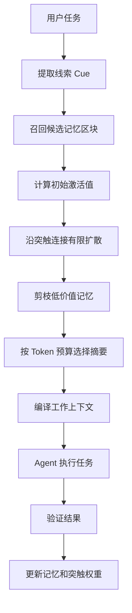

# 渐进式突触记忆：面向 LLM Agent 的低 Token 长期记忆机制

> Progressive Synaptic Memory: A Token-Efficient Long-Term Memory Mechanism for LLM Agents

作者：九思  
状态：概念论文 / 技术白皮书草稿  
版本：0.1

## 摘要

当前多数 LLM Agent 的长期记忆系统仍然采用“存储后检索”的方式：用户提出问题后，系统从历史对话、文档或向量库中检索若干条记忆，再将这些记忆直接放入模型上下文。这种方式简单可用，但当记忆规模变大时，会带来上下文膨胀、Token 成本升高、无关记忆干扰推理，以及 Agent 无法像人一样“先想起大概，再逐步想起细节”的问题。

本文提出一种 **渐进式突触记忆机制**。该机制不把记忆视为等待检索的静态文本，而是将记忆组织为可休眠、可压缩、可连接、可逐层唤醒的记忆区块网络。系统在运行时先根据当前任务激活少量线索，再沿着记忆区块之间的突触连接进行有限扩散，通过相关性、重要性、置信度、休眠程度和 Token 预算进行剪枝，最后只将最有用的少量摘要、SOP 或经验结论交给 Agent。

该方法的目标不是让 Agent “记住更多文本”，而是让 Agent “在正确时刻想起正确的东西”。它可以用于个人助理、企业 Agent 员工系统、多 Agent 编排系统、SOP 学习系统、客户偏好记忆系统和长期项目协作系统。

## 关键词

LLM Agent, Long-Term Memory, Synaptic Memory, Graph Memory, Progressive Retrieval, Memory Compression, SOP, Skills, Token Efficiency, Agent Runtime

## 1. 问题背景

LLM Agent 要长期服务用户，必须拥有记忆。没有记忆的 Agent 只能像一次性聊天机器人；有记忆的 Agent 才能理解用户偏好、项目历史、失败经验、工具使用方式和可复用流程。

但是，当前常见记忆方案存在一个核心矛盾：

```txt
记忆越多，Agent 越可能有经验；
但记忆越多，放进上下文的 Token 越贵，干扰也越大。
```

直接把历史记录放入上下文不可扩展。即使使用向量数据库，也只是把“全量塞入”变成“相似文本检索”。它仍然容易出现三个问题：

1. 检索到的文本可能相似，但不一定对当前任务有用。
2. 多跳记忆关系难以被一次检索捕获。
3. 检索结果通常是文本块，仍然需要消耗大量 Token。

人类记忆并不是这样工作的。人不会在思考一个问题时一次性回放所有过去经历，而是会先想起一个模糊场景，再根据这个场景联想到更多相关片段，最后形成对当前问题有用的判断。

本文尝试把这种“逐步想起来”的机制抽象为一种 Agent 记忆系统。

## 2. 核心观点

本文的核心观点是：

> Agent 的记忆不应该是静态数据库，而应该是一个可以休眠、激活、扩散、剪枝和强化的突触网络。

更具体地说：

```txt
记忆不是永久删除，而是分层休眠。
回忆不是一次检索，而是渐进唤醒。
上下文不是历史仓库，而是当前工作记忆。
SOP 不是普通文本，而是被验证过的程序记忆。
Skill 是能力，SOP 是能力的稳定调用路径。
突触连接负责判断：什么场景下该想起什么。
```

因此，系统应该遵循一个原则：

> 数据库可以很胖，但上下文必须很瘦。

## 3. 记忆分层模型

渐进式突触记忆将 Agent 记忆分为四层。

### 3.1 原始记忆层

原始记忆层保存完整信息，例如：

- 原始对话
- 工具调用日志
- 浏览器截图
- 文件修改记录
- 终端输出
- Agent 执行轨迹
- 用户反馈
- 验证结果

这一层最完整，但最昂贵，默认不进入模型上下文。

### 3.2 记忆区块层

系统将原始记忆压缩成 Memory Block。一个 Memory Block 不是随意切分的文本块，而是一个有意义的经验单元，例如：

- 一个用户偏好
- 一个失败教训
- 一个成功经验
- 一个项目状态
- 一个软件使用方法
- 一个可复用工作场景

示例：

```txt
记忆区块：中文桌面端 UI 简化场景
触发条件：用户抱怨界面复杂、英文过多、导航点击无反馈
经验结论：左侧只做导航，右侧展示完整操作页；高级配置默认折叠；核心动作前置
关联 SOP：cn_desktop_ui_simplification_v2
```

### 3.3 突触连接层

Memory Block 之间可以建立连接。连接不是普通超链接，而是带权重、方向、关系类型和成功反馈的突触边。

例如：

```txt
中文用户偏好 -> 中文界面简化 SOP
界面复杂反馈 -> 低认知负担设计原则
模型连接失败 -> 模型配置检测 SOP
客户项目 A -> 客户 A 的长期偏好
```

这些连接允许系统在需要时进行有限扩散，模拟“想起一个场景后，又想起另一个相关场景”。

### 3.4 工作记忆层

工作记忆层是最终进入模型上下文的少量内容。它通常只包含：

- 当前任务目标
- 当前最佳场景摘要
- 3 到 5 条相关记忆摘要
- 1 到 2 条失败警告
- 推荐 SOP / Skill / 工具

工作记忆层必须受 Token 预算限制。

## 4. 休眠式遗忘

本文中的“遗忘”不是删除，而是降级。

记忆可以有四种状态：

```txt
Active：当前活跃，可能进入上下文
Warm：近期有用，可快速唤醒
Dormant：休眠，只保留标签和摘要
Archived：归档，只在深度检索时访问
```

低频、低价值、低置信度的记忆会逐渐休眠。休眠记忆不会占用上下文，但仍然保留触发标签和原始引用。

这种设计可以避免两个极端：

```txt
完全不忘：Token 爆炸
直接删除：经验丢失
```

更合理的方式是：

```txt
不重要的记忆睡着；
重要线索出现时再醒来；
先醒来摘要；
必要时再醒来细节。
```

## 5. 渐进式突触唤醒算法

### 5.1 总体流程



### 5.2 数据结构

```ts
type MemoryBlock = {
  id: string
  title: string

  cues: string[]
  tags: string[]
  summary: string
  detailRef: string
  rawRef: string

  embedding: number[]

  importance: number
  confidence: number
  usageCount: number
  lastUsedAt: Date

  dormantLevel: number
}
```

```ts
type SynapseLink = {
  fromMemoryId: string
  toMemoryId: string

  relation:
    | 'same_scene'
    | 'same_user'
    | 'same_problem'
    | 'same_solution'
    | 'caused_by'
    | 'fixed_by'
    | 'uses_same_skill'
    | 'calls_same_sop'

  weight: number
  confidence: number
  successCount: number
  failureCount: number
  lastActivatedAt: Date
}
```

### 5.3 初始召回

系统先根据当前任务提取线索：

```ts
type QueryCue = {
  intent: string
  entities: string[]
  sceneTags: string[]
  problemTags: string[]
  userPreferenceTags: string[]
  artifactType?: string
}
```

候选记忆分数：

```txt
candidateScore =
  semanticSimilarity * 0.35
+ tagMatch           * 0.25
+ importance         * 0.15
+ recency            * 0.10
+ confidence         * 0.10
- dormantPenalty     * 0.15
```

这个阶段只选候选，不直接放入上下文。

### 5.4 突触扩散

被激活的记忆区块会将一部分激活值传递给相邻区块：

```txt
activation[next] += activation[current]
                  * synapseWeight
                  * relationBoost
                  * contextFit
                  - dormantPenalty
```

为了避免“牵一发而动全身”导致 Token 爆炸，必须限制扩散：

```txt
最大扩散深度：1 到 2 层
每层最多扩散：5 到 8 个节点
最低激活阈值：0.45
最终进入上下文：3 到 5 个记忆摘要
```

### 5.5 渐进展开

记忆展开必须分阶段：

```txt
第 1 阶段：只使用 tags
第 2 阶段：展开 summary
第 3 阶段：必要时读取 detail
第 4 阶段：极少数情况下读取 raw
```

这就是“先想起大概，再想起细节”。

### 5.6 上下文编译

Context Compiler 根据 Token 预算生成最终上下文。

示例预算：

```txt
总记忆预算：1000 tokens

当前最佳场景：200 tokens
相关记忆摘要：400 tokens
失败警告：150 tokens
推荐 SOP / Skill：250 tokens
```

如果超出预算，则优先保留：

1. 与当前任务目标直接相关的记忆
2. 高置信度成功经验
3. 高风险失败警告
4. 用户长期偏好
5. 当前项目状态

## 6. SOP 与 Skills 的关系

本文区分 Skill 和 SOP。

```txt
Skill = 能力包
SOP = 被验证过的流程
Synapse = 判断什么时候调用哪个 SOP / Skill 的连接经验
```

例如：

```txt
Skill：前端实现能力
SOP：中文桌面端 UI 简化流程
Synapse：当用户抱怨“复杂、看不懂、英文多”时，激活该 SOP
```

当 Agent 反复通过某个 Skill 完成同类任务后，系统可以将成功轨迹压缩成 SOP。下次遇到类似场景时，不再加载完整历史，而是只加载 SOP ID、摘要和关键规则。

这可以显著降低 Token 成本。

## 7. 与现有研究的关系

本文并不是从零发明所有组件，而是将多个研究方向组合到 Agent 产品场景中。

### 7.1 MemGPT

[MemGPT](https://arxiv.org/abs/2310.08560) 将 LLM 记忆管理类比为操作系统的分层内存，通过虚拟上下文管理在有限上下文窗口中使用更大的外部记忆。本文继承其“上下文不是全部记忆，而是工作内存”的思想。

### 7.2 Mem0

[Mem0](https://arxiv.org/abs/2504.19413) 提出面向生产环境的长期记忆架构，通过抽取、合并和检索显著降低 Token 成本。其论文报告了相较 full-context 方法超过 90% 的 Token 成本节省。本文进一步强调记忆的休眠、突触连接和渐进展开。

### 7.3 A-MEM

[A-MEM](https://arxiv.org/abs/2502.12110) 借鉴 Zettelkasten 方法，将记忆组织成动态链接的知识网络。本文与其相似之处在于都强调动态连接；不同之处在于本文更关注“连接如何在运行时被激活、剪枝和预算编译”。

### 7.4 MRAgent

[Memory is Reconstructed, Not Retrieved](https://arxiv.org/abs/2606.06036) 提出 Cue-Tag-Content 图和主动记忆重构机制，强调记忆不是静态检索，而是在推理过程中逐步重构。本文与该方向高度接近，并将其扩展到 Agent 员工系统中的 SOP、Skill、工具调用和多 Agent 编排场景。

### 7.5 程序记忆与 SOP

[MemP: Exploring Agent Procedural Memory](https://arxiv.org/abs/2508.06433) 关注如何将 Agent 历史轨迹蒸馏为程序记忆。本文中的 SOP 可以看作程序记忆在产品工程中的落地形态。

## 8. 价值判断

该机制的价值不在于单点技术完全原创，而在于系统组合：

```txt
分层记忆
+ 休眠式遗忘
+ 突触连接图
+ 渐进式唤醒
+ SOP 程序记忆
+ Token 预算编译
+ 执行结果反馈学习
```

如果实现得好，它可以解决当前 Agent 产品中的几个核心痛点：

1. 长期记忆 Token 成本过高
2. 检索结果相似但不真正有用
3. Agent 无法积累稳定工作流程
4. 用户偏好和项目经验难以持续复用
5. 多 Agent 系统之间共享记忆容易混乱
6. 成功经验没有沉淀成可复用 SOP

因此，该方案适合作为 Agent 操作系统或 Agent 员工工厂中的记忆核心。

## 9. 初步评估方案

可以设计以下实验验证该机制。

### 9.1 Token 成本

对比三种方案：

```txt
Full Context：放入完整历史
Vector RAG：检索 Top-K 文本块
Progressive Synaptic Memory：渐进式突触记忆
```

指标：

- 平均输入 Token
- 平均输出 Token
- 单任务总成本
- 延迟

### 9.2 任务完成质量

指标：

- 用户偏好命中率
- 项目状态一致性
- 多步任务成功率
- 错误重复率
- SOP 调用准确率

### 9.3 记忆唤醒质量

指标：

- 相关记忆召回率
- 无关记忆引入率
- 多跳记忆命中率
- 摘要足够率
- 需要展开 raw memory 的比例

### 9.4 学习效果

指标：

- 成功 SOP 复用率
- 失败经验复用率
- 突触权重稳定性
- 长期用户偏好保持率

## 10. 局限性

该机制仍然存在一些问题：

1. 记忆区块如何自动切分，需要进一步实验。
2. 突触连接如果错误强化，可能导致错误经验被反复调用。
3. 过度压缩可能丢失关键细节。
4. 记忆唤醒算法需要防止图扩散失控。
5. 复杂系统需要可解释 UI，让用户知道 Agent 为什么想起这条记忆。

因此，生产环境中必须加入：

- 人工审核重要 SOP
- 记忆置信度
- 失败反馈
- 连接权重衰减
- 原始记忆可追溯
- 可解释的记忆调用日志

## 11. 结论

本文提出的渐进式突触记忆机制，试图将 Agent 记忆从“文本检索系统”升级为“经验唤醒系统”。

它的核心不是让模型看到所有历史，而是让系统在当前场景下逐层唤醒最有用的记忆：

```txt
先想起标签
再想起摘要
再想起细节
最后才读取原始记录
```

这种设计可以让 Agent 在保持长期经验的同时显著降低 Token 成本，并且更适合与 SOP、Skills、多 Agent 编排和电脑操作运行时结合。

一句话总结：

> 记忆不应该被一次性检索出来，而应该被逐步唤醒、重构和压缩成当前任务真正需要的工作上下文。

## 参考资料

- MemGPT: Towards LLMs as Operating Systems: https://arxiv.org/abs/2310.08560
- Mem0: Building Production-Ready AI Agents with Scalable Long-Term Memory: https://arxiv.org/abs/2504.19413
- A-MEM: Agentic Memory for LLM Agents: https://arxiv.org/abs/2502.12110
- Memory is Reconstructed, Not Retrieved: Graph Memory for LLM Agents: https://arxiv.org/abs/2606.06036
- MemP: Exploring Agent Procedural Memory: https://arxiv.org/abs/2508.06433
